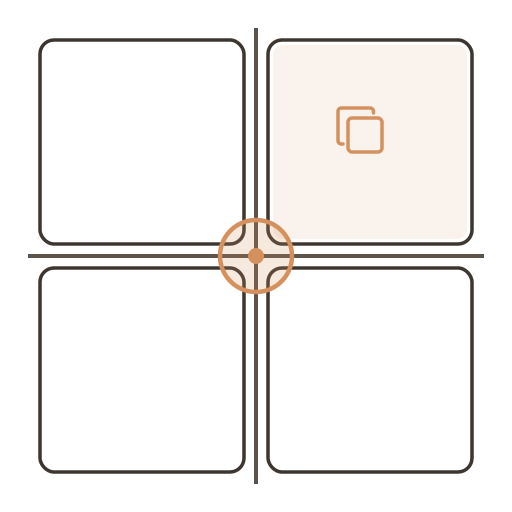
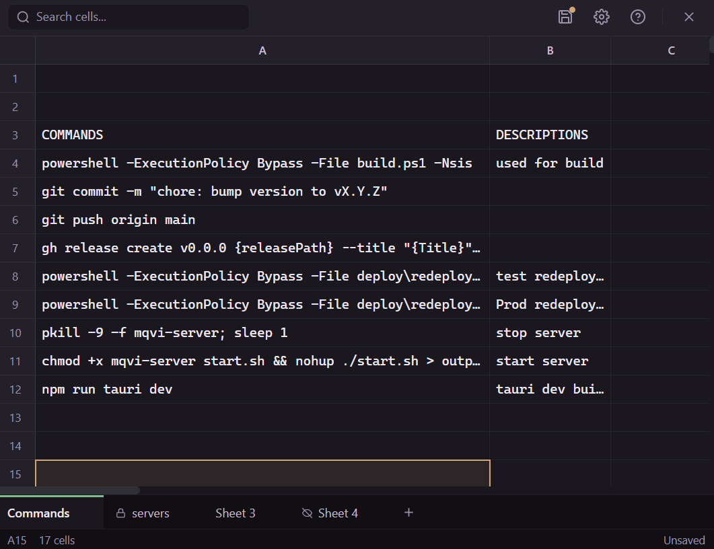
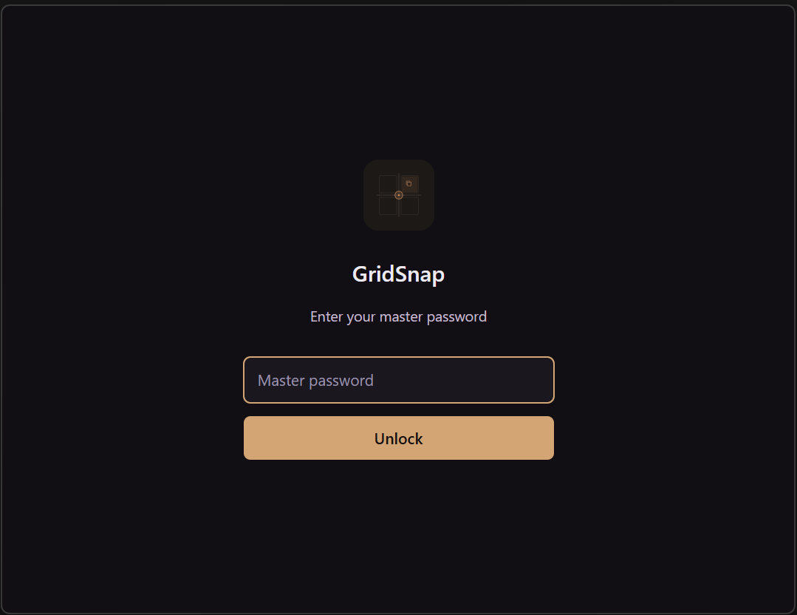
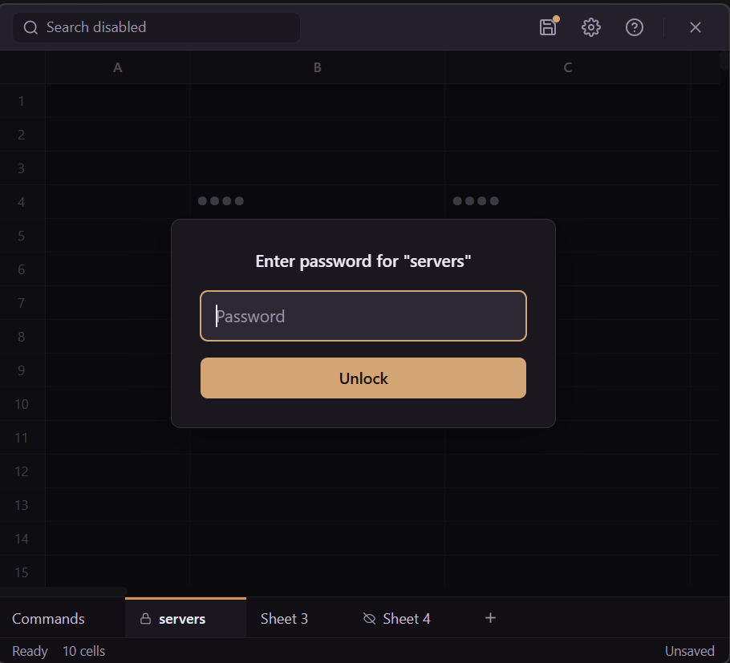
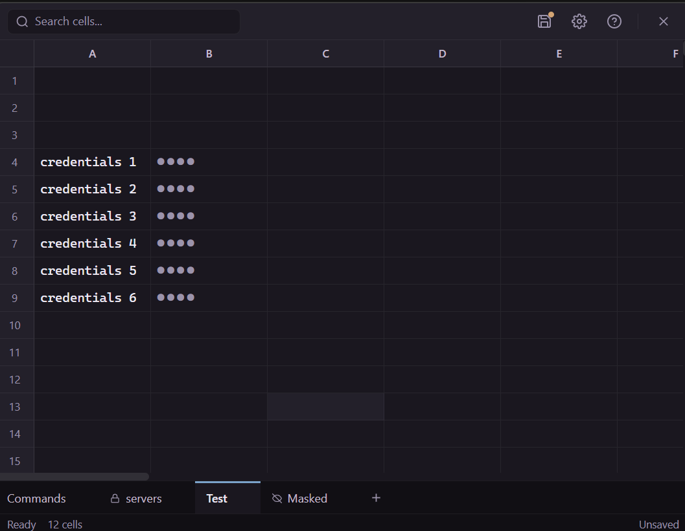
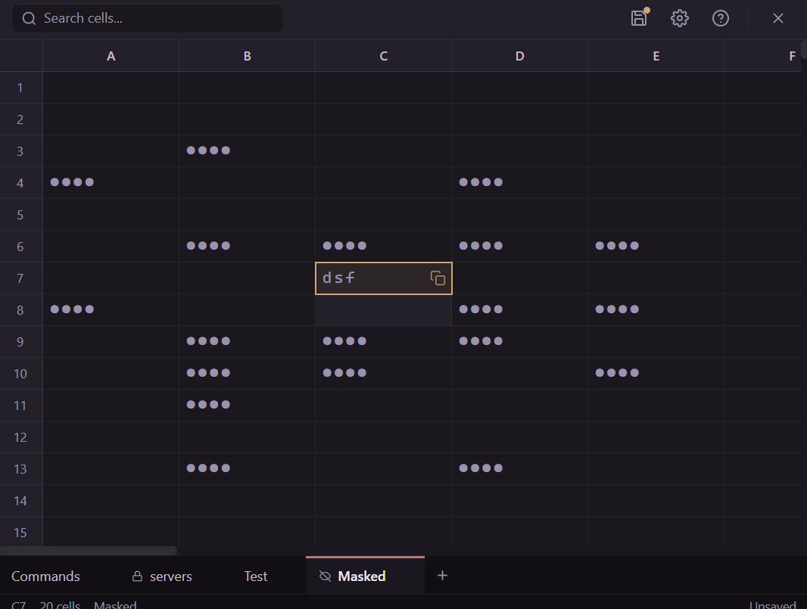
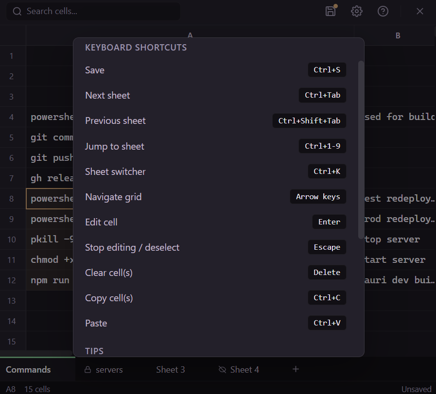
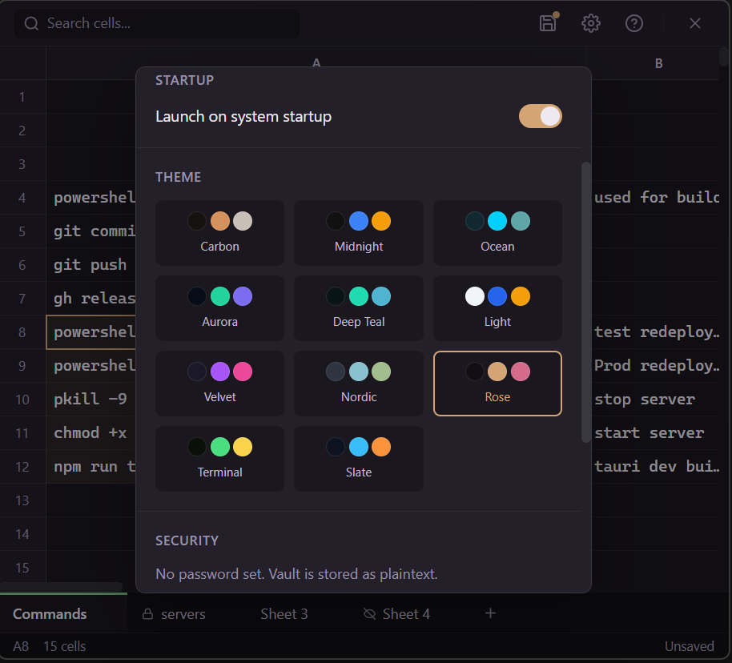

<p align="center">
  <a href="README_TR.md">🇹🇷 Türkçe</a>
</p>

<p align="center">
  
</p>

<h3 align="center">Download</h3>
<p align="center">
  <a href="https://github.com/akinalpfdn/GridSnap/releases/latest/download/GridSnap-windows-x64-setup.exe"></a>
  &nbsp;&nbsp;
  <a href="https://github.com/akinalpfdn/GridSnap/releases/latest/download/GridSnap-macos-arm64.dmg"></a>
  &nbsp;&nbsp;
  <a href="https://github.com/akinalpfdn/GridSnap/releases/latest/download/GridSnap-linux-x64.AppImage"></a>
</p>
<h1 align="center">GridSnap</h1>

<p align="center">
  <strong>Encrypted grid-based note manager for sensitive data.</strong><br>
  SSH commands, credentials, API keys, code snippets — all one hotkey away.
</p>


<p align="center">
  
  
  
  
  
</p>

<p align="center">
  
  
  
</p>

---

<p align="center">
  
</p>

---

## Screenshots

<p align="center">
  
  <br>
  <sub>Store commands, credentials, and notes — click any cell to copy</sub>
</p>

<table>
<tr>
<td align="center">
  <br>
  <sub>Optional master password to encrypt the vault</sub>
</td>
<td align="center">
  <br>
  <sub>Per-sheet passwords — each sheet locks independently</sub>
</td>
</tr>
<tr>
<td align="center">
  <br>
  <sub>Mask individual cells to hide sensitive values</sub>
</td>
<td align="center">
  <br>
  <sub>Mask entire sheets — all values shown as ●●●●</sub>
</td>
</tr>
<tr>
<td align="center">
  <br>
  <sub>Built-in help panel with keyboard shortcuts</sub>
</td>
<td align="center">
  <br>
  <sub>11 built-in themes — pick your style</sub>
</td>
</tr>
</table>

---

## Why GridSnap?

You probably have credentials, SSH commands, connection strings, and API keys scattered across sticky notes, text files, and password managers that aren't designed for quick copy-paste workflows.

GridSnap gives you a **spreadsheet-like grid** that lives in your system tray. Press `Ctrl+Shift+Space`, click a cell, and it's on your clipboard. Everything is encrypted at rest with AES-256-GCM.

**This is not a password manager.** It's a fast, encrypted scratch grid for things you copy-paste daily.

---

## Features

**Grid Engine**
- Virtualized 1000×26 grid — scrolls at 60fps
- Keyboard navigation (Arrow keys, Tab, Enter, Escape)
- Type-to-edit: start typing to fill a cell
- **Multi-cell selection** — click & drag or Shift+Arrow to select ranges
- Hover or click a cell to copy — inline copy button with checkmark feedback
- `Ctrl+C` copies selection (TSV format for ranges — paste into Excel/Sheets)
- `Ctrl+V` pastes TSV data into grid starting from selected cell
- Column resize (50–600px), row resize (22–120px)
- Search across all cells with instant highlighting (disabled on locked sheets)
- Manual save with `Ctrl+S` or toolbar button (no auto-save lag)
- Built-in help panel (`?` button) — keyboard shortcuts and usage tips

**Sheets**
- Multiple sheets with colored tabs
- Add, remove, rename with delete confirmation
- Drag tabs to reorder sheets
- Switch sheets with `Ctrl+Tab` / `Ctrl+Shift+Tab`, or `Ctrl+1-9` for direct jump
- `Ctrl+K` opens a quick-switch palette — search sheets by name
- Right-click a tab to rename, mask, or manage password
- **Sheet masking** — right-click a tab → Mask sheet to show all values as `●●●●`
- **Per-cell masking** — right-click cells to mask/unmask individual cells or ranges
- **Per-sheet passwords** — right-click a tab → Set password (AES-256-GCM + Argon2id)
- Password-protected sheets lock on every tab switch — no session persistence
- Search is disabled on locked sheets (prevents data leakage)
- Deleting a password-protected sheet requires password confirmation
- Brute force protection: 10 wrong attempts → 2-minute cooldown (persisted, survives restart)
- Each sheet can have its own independent password

**Security**
- **Passwordless by default** — opens directly on first install, no setup required
- Optional master password (set in Settings to encrypt vault)
- Optional per-sheet passwords (independent of vault password)
- AES-256-GCM encryption with Argon2id key derivation (64MB memory, 3 iterations)
- Keys are zeroized from memory after use
- No network access, no telemetry, no cloud

**Desktop Integration**
- **Always on top** — stays visible while you work in other apps
- Borderless window with custom title bar
- System tray with show/hide toggle
- Global hotkey (default `Ctrl+Shift+Space`, configurable in Settings)
- Close button minimizes to tray — the app stays ready
- Optional launch on system startup (configurable in Settings)
- ~8.5MB bundle, ~30MB RAM

**Theming**
- 11 built-in themes selectable from Settings
- Carbon (default), Midnight, Ocean, Aurora, Deep Teal, Light, Velvet, Nordic, Rose, Terminal, Slate
- Theme persists across sessions

---

## Installation

### Build from Source

**Prerequisites:** [Node.js](https://nodejs.org/) 18+, [Rust](https://rustup.rs/) 1.70+

```bash
git clone https://github.com/akinalpfdn/GridSnap.git
cd GridSnap/gridsnap
npm install
npm run tauri dev      # Development with hot reload
npm run tauri build    # Production build
```

---

## Usage

1. **First launch** — opens directly, no setup required
2. **Navigate** — click a cell or use arrow keys
3. **Edit** — double-click or press Enter, then type
4. **Copy** — hover a cell and click the copy icon, or press `Ctrl+C`
5. **Paste** — copy TSV data and press `Ctrl+V` to fill multiple cells
6. **Save** — press `Ctrl+S` or click the save button in the toolbar
7. **New sheet** — click `+` in the tab bar
8. **Switch sheets** — click a tab, `Ctrl+Tab` / `Ctrl+Shift+Tab`, `Ctrl+1-9`, or `Ctrl+K` to search
9. **Reorder sheets** — drag tabs to rearrange
10. **Mask a sheet** — right-click the tab → Mask sheet
11. **Mask cells** — select cells, right-click → Mask cells
12. **Sheet password** — right-click the tab → Set password
13. **Set master password** — go to Settings to optionally encrypt the vault
14. **Help** — click the `?` button in the toolbar for shortcuts and tips
15. **Hide** — press `Ctrl+Shift+Space` or close the window (goes to tray)
16. **Quit** — right-click the tray icon → Quit

---

## Tech Stack

| Layer | Technology |
|-------|-----------|
| Shell | Tauri v2 (~8.5MB bundle, native OS webview) |
| Frontend | React 18 + TypeScript |
| Styling | CSS Modules + CSS Custom Properties |
| Grid | Custom virtualized renderer (prefix-sum + binary search) |
| State | Zustand |
| Build | Vite 6 |
| Encryption | AES-256-GCM + Argon2id (Rust) |
| Storage | Encrypted JSON vault (Rust fs) |

---

## Project Structure

```
gridsnap/
├── src/                    # React frontend
│   ├── components/         # Grid, Sheets, Toolbar, LockScreen
│   ├── hooks/              # Navigation, resize, clipboard, search
│   ├── stores/             # Zustand (vaultStore)
│   ├── services/           # Tauri IPC bridge (vault, clipboard, shortcut, autostart, sheet password)
│   ├── theme/              # CSS tokens + themes
│   ├── types/              # TypeScript definitions
│   └── utils/              # Grid math, cell keys, debounce
│
├── src-tauri/              # Rust backend
│   ├── src/commands/       # IPC handlers (vault, clipboard, shortcut, autostart, sheet password)
│   ├── src/services/       # Encryption, storage, vault manager
│   ├── src/models/         # Vault, Sheet, Settings structs
│   └── src/tray.rs         # System tray setup
│
└── icons/                  # App icons (all platforms)
```

---

## Keyboard Shortcuts

| Shortcut | Action |
|----------|--------|
| `Ctrl+Shift+Space` | Toggle window (global, configurable) |
| `Arrow keys` | Navigate cells |
| `Shift+Arrow` | Extend selection range |
| `Tab` / `Shift+Tab` | Move right / left |
| `Enter` | Edit cell / move down |
| `Escape` | Stop editing / deselect |
| `Ctrl+C` | Copy cell value (TSV for ranges) |
| `Ctrl+V` | Paste TSV data into grid |
| `Ctrl+Tab` | Next sheet |
| `Ctrl+Shift+Tab` | Previous sheet |
| `Ctrl+1-9` | Jump to sheet by position |
| `Ctrl+K` | Sheet switcher palette |
| `Ctrl+S` | Save vault |
| `Delete` | Clear cell or selected range |
| Any key | Type-to-edit selected cell |

---

## Theming

GridSnap ships with **11 built-in themes** selectable from Settings. The default **Carbon** theme is a warm dark theme with amber accents.

Available themes: Carbon, Midnight, Ocean, Aurora, Deep Teal, Light, Velvet, Nordic, Rose, Terminal, Slate.

Themes use CSS custom properties (`--theme-*`). To create a custom theme, add an entry to `src/theme/themes.ts` with your color definitions — no component changes needed.

---

## Security Model

- **Passwordless by default** — vault is stored as plaintext JSON until a password is set
- **Optional vault encryption**: Set a master password in Settings to enable AES-256-GCM encryption
- **Per-sheet passwords**: Each sheet can have its own password (independent of vault password)
  - Encrypts a verification token with AES-256-GCM + Argon2id — no plaintext hashes stored
  - Sheets re-lock on every tab switch (no session persistence)
  - 10 failed attempts → 2-minute cooldown, persisted in vault (cannot bypass by restarting)
  - Only the correct password resets the attempt counter
- **Key derivation**: Argon2id (64MB memory, 3 iterations, 4 parallelism)
- **Storage format** (encrypted): `[salt 16B | nonce 12B | ciphertext | tag 16B]`
- **Memory safety**: Rust backend with `zeroize` for sensitive data cleanup
- **No network**: the app makes zero outbound connections

---

## Contributing

Contributions are welcome! Please:

1. Fork the repo
2. Create a feature branch (`git checkout -b feature/amazing-thing`)
3. Commit your changes
4. Push and open a PR

---

## License

[MIT](LICENSE)

---

<p align="center">
  <sub>Built with Tauri, React, and Rust. Encrypted by default.</sub>
</p>
